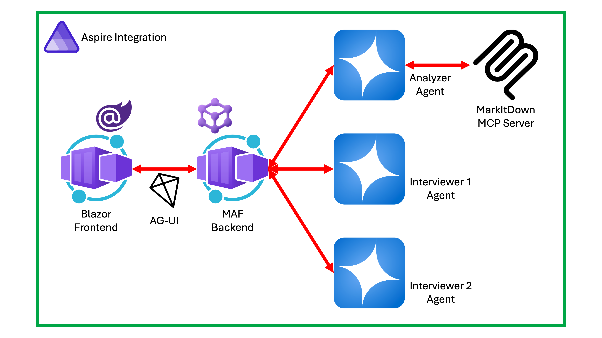

# Interview Coach with Microsoft Agent Framework

This is a sample application practicing job interview using [Microsoft Agent Framework](https://aka.ms/agent-framework).

## Architecture

## Prerequisites

- [.NET 10 SDK](https://dotnet.microsoft.com/download/dotnet/10.0) or later
- [Visual Studio 2026](https://visualstudio.microsoft.com/downloads/) or [VS Code](http://code.visualstudio.com/download) + [C# Dev Kit](https://marketplace.visualstudio.com/items?itemName=ms-dotnettools.csdevkit)
- [Azure Subscription (Free)](http://azure.microsoft.com/free)

## Getting Started

TBD

## Additional Resources

- [Microsoft Agent Framework](https://aka.ms/agent-framework)
- [Multi-Agent Orchestration Pattern](https://learn.microsoft.com/agent-framework/user-guide/workflows/orchestrations/overview)
- [AG-UI Protocol](https://docs.ag-ui.com/introduction)
- [MarkItDown MCP Server](https://github.com/microsoft/markitdown/tree/main/packages/markitdown-mcp)
- [Outlook Email MCP Server](https://github.com/microsoft/mcp-dotnet-samples/tree/main/outlook-email)
- [OneDrive Download MCP Server](https://github.com/microsoft/mcp-dotnet-samples/tree/main/onedrive-download)
- [Google Drive Download MCP Server](https://github.com/microsoft/mcp-dotnet-samples/tree/main/googledrive-download)
