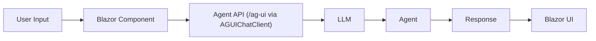
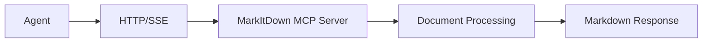
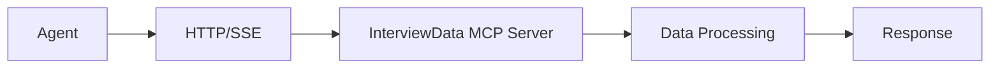
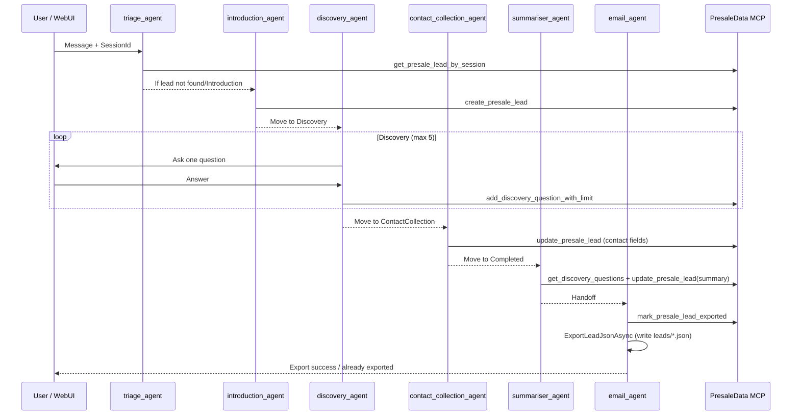

<!-- Generated by GitHub Copilot on 2026-03-29 -->
# Architecture overview

How the Interview Coach is put together and why.

## System architecture

[Aspire](https://aspire.dev) orchestrates the services: agent, web UI, MCP servers, and a SQLite database. Each runs as a separate process with service discovery wiring them together.

A few decisions shaped the design:

1. **MCP for tools and state** - Document parsing and business persistence live in separate MCP servers. The agent and UI do not access storage directly.
2. **Provider abstraction** — The LLM backend is swappable at runtime: Foundry, Azure OpenAI, or GitHub Models.
3. **Aspire orchestration** — Service discovery, health checks, and telemetry come free from .NET Aspire.
4. **Stateful sessions** - Interview/presale sessions persist to SQLite so users can pause and resume.
5. **Thin WebUI shell (Phase 5)** - The UI handles presentation and session-id transport, while workflow logic and state transitions live in agent + MCP layers.

## Component Deep Dive

### 1. InterviewCoach.Agent (AI agent service)

The agent runs the interview. It decides what to ask, when to call tools, and how to respond.

Built on ASP.NET Core, Microsoft Agent Framework, and the OpenAI SDK. Talks to the web UI via the AG-UI protocol and to tools via MCP clients.

- Runs as a single agent or as 5 specialists in handoff mode (configurable)
- Has step-by-step interview instructions (scoped per-agent in handoff mode)
- Calls MarkItDown (document parsing) and InterviewData (session storage) through MCP
- Uses the `IChatClient` interface, so the LLM provider is pluggable

### 2. InterviewCoach.WebUI (user interface)

A Blazor web app where users chat with the agent. Styled with Tailwind CSS, renders markdown with Marked.js, and sanitizes input with DOMPurify. Communicates with the agent over AG-UI.

Phase 5 responsibilities:

- Generate the per-chat SessionId and pass it through system messages.
- Render chat history, assistant responses, citations, and suggestions.
- Handle attachments and upload flow.
- Avoid local presale business state and phase logic.

**Communication Flow**:

### 3. InterviewCoach.Mcp.MarkItDown (document parsing)

Converts PDFs, DOCX files, and other documents to markdown so the agent can read them. This is [Microsoft's MarkItDown](https://github.com/microsoft/markitdown) running as an MCP server in a Docker container.

It's external (Python-based) because it's reusable across projects and maintained independently. It also shows how to integrate a third-party MCP server.

**Integration Pattern**:

### 4. InterviewCoach.Mcp.InterviewData (interview session storage)

A custom .NET MCP server that stores interview sessions in SQLite via Entity Framework Core. Built with the `ModelContextProtocol.Server` SDK.

**Integration Pattern**:

### 5. InterviewCoach.Mcp.PresaleData (presale persistence)

Custom .NET MCP server for the Baoh Assistant presale workflow. Stores lead records and normalized discovery Q&A in SQLite using EF Core.

Primary model fields:

- `PresaleLead`: `SessionId`, `CurrentPhase`, `RequestType`, `DiscoveryQuestionCount`, `Summary`, contact fields, `Transcript`, `ExportedAt`, timestamps.
- `DiscoveryQuestion`: `PresaleLeadId`, `Sequence`, `Question`, `Answer`, timestamp.

Tool contract exposed through MCP:

- `create_presale_lead`
- `get_presale_lead`
- `get_presale_lead_by_session`
- `update_presale_lead`
- `add_discovery_question`
- `add_discovery_question_with_limit`
- `get_discovery_questions`
- `mark_presale_lead_exported`

Server-side invariants:

- Discovery question cap is enforced atomically by `add_discovery_question_with_limit` using a serializable transaction.
- Duplicate export prevention is enforced atomically by `mark_presale_lead_exported` and persisted via `ExportedAt`.

### 6. InterviewCoach.AppHost (Aspire orchestration)

The Aspire app model. Defines which services exist, how they depend on each other, and what config they get.

AppHost wires the following runtime chain for Baoh mode:

- Agent references `mcp-markitdown`, `mcp-interview-data`, and `mcp-presale-data`.
- `mcp-interview-data` and `mcp-presale-data` both reference the shared SQLite resource.
- WebUI references the Agent only.

### 7. InterviewCoach.ServiceDefaults (shared defaults)

OpenTelemetry, health checks, service discovery, and HTTP client defaults. Shared across all projects so you don't repeat the setup.

## Baoh Assistant Workflow (Primary)

## Phase 6 verification focus

Phase 6 validates:

- Routing and resume behavior by persisted `CurrentPhase`.
- Discovery hard-cap enforcement through MCP contract results.
- Duplicate export prevention using `mark_presale_lead_exported`.
- End-to-end startup wiring across AppHost, Agent, WebUI, and MCP services.

## Next steps

- [Learning objectives](LEARNING-OBJECTIVES.md)
- [Tutorials](TUTORIALS.md)
- [FAQ](FAQ.md)
