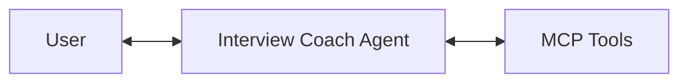
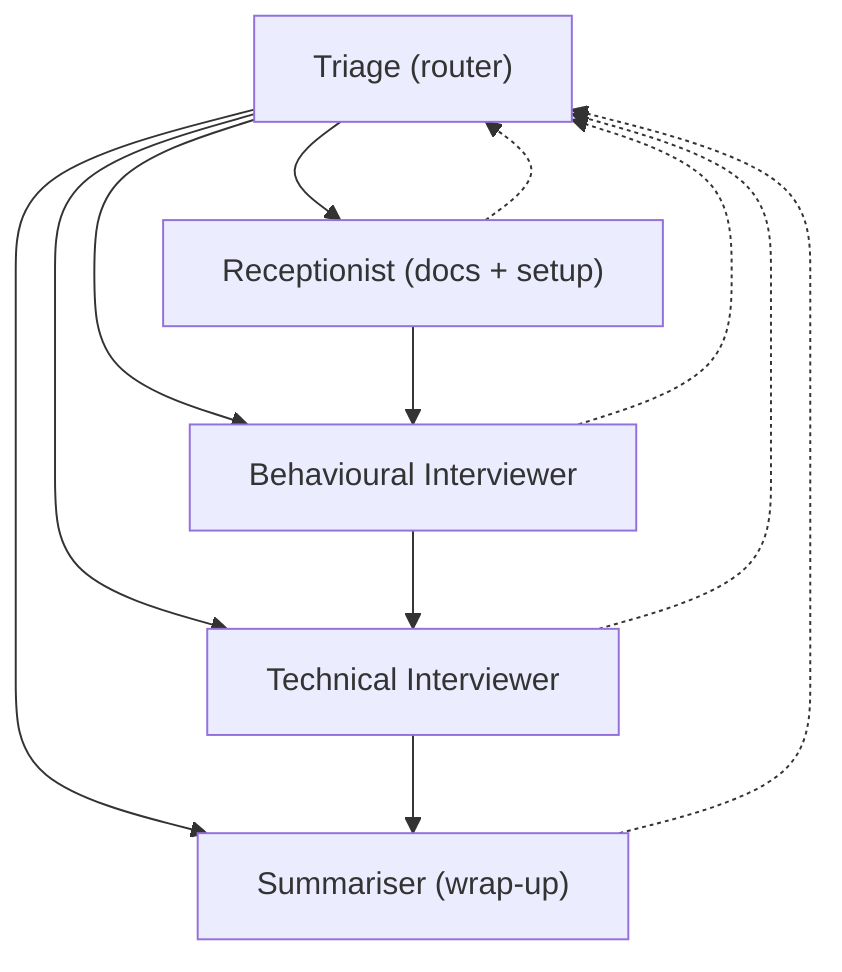
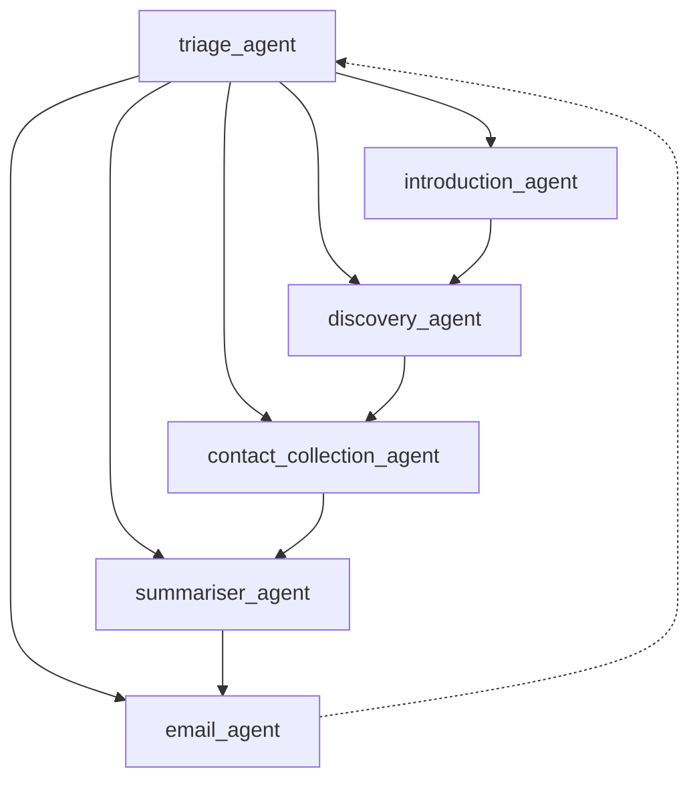

<!-- Generated by GitHub Copilot on 2026-03-29 -->
# Multi-agent architecture

This project supports multiple orchestration modes with [Microsoft Agent Framework](https://aka.ms/agent-framework). The current primary path is the Baoh presale workflow.

## Overview

| Mode | Approach | Agent Count | State + Tools | Best For |
|------|----------|-------------|---------------|----------|
| **Single** | Single agent interview coach | 1 | MarkItDown + InterviewData MCP | Simple deployments and basic interview scenarios |
| **LlmHandOff** | Multi-agent interview handoff | 5 | Scoped MCP tools per specialist | Interview coaching with specialist routing |
| **BaohAssistant** | Presale multi-agent handoff | 6 | PresaleData MCP + local JSON export tool | Presale discovery, contact capture, and structured lead export |

## How to switch modes

The active mode is controlled by the `AgentMode` setting in `apphost.settings.json`:

```json
{
    // Available: Single | LlmHandOff | BaohAssistant
    "AgentMode": "BaohAssistant"
}
```

You can also pass the mode as a CLI argument:

```bash
# Mode 1: Single
aspire run --file ./apphost.cs -- --mode Single

# Mode 2: Multi-agent handoff (LLM)
aspire run --file ./apphost.cs -- --mode LlmHandOff

# Mode 3: Multi-agent handoff (GitHub Copilot)
aspire run --file ./apphost.cs -- --provider GitHubCopilot --mode CopilotHandOff
```

> **NOTE**: Choosing `Copilot` as the agent mode only allows the LLM provider of `GitHubCopilot`.

## Mode 1: Single agent

The simplest setup — one `ChatClientAgent` does everything.



The agent has a comprehensive instruction prompt covering session management, document intake, behavioural questions, technical questions, and summarization. All MCP tools (MarkItDown + InterviewData) are available to the single agent.
See `CreateSingleAgent()` in [AgentDelegateFactory.cs](../src/InterviewCoach.Agent/AgentDelegateFactory.cs).

Good for getting started or when you do not need specialist handoff logic.

## Mode 2: LlmHandOff

Splits the coach into 5 specialized agents connected via the [handoff pattern](https://learn.microsoft.com/en-us/agent-framework/workflows/orchestrations/handoff).

### What is handoff?

In the handoff pattern, one agent transfers full control of the conversation to another. Unlike "agent-as-tools" (where a primary agent calls others as helpers), the receiving agent takes over entirely. This fits the interview flow well because each phase has its own job.

### Agent topology



**Triage** is the entry point and fallback. The happy-path flow is sequential: Receptionist → Behavioural Interviewer → Technical Interviewer → Summariser. Each specialist hands off directly to the next agent in sequence. Specialists can fall back to Triage for out-of-order requests.

### The 5 agents

| Agent                                                   | Role                                                | MCP Tools                  |
|---------------------------------------------------------|-----------------------------------------------------|----------------------------|
| **Triage** (`triage`)                                   | Routes messages to the right specialist             | None (pure routing)        |
| **Receptionist** (`receptionist`)                       | Creates sessions, collects resume & job description | MarkItDown + InterviewData |
| **Behavioural Interviewer** (`behavioural_interviewer`) | Conducts behavioural questions using STAR method    | InterviewData              |
| **Technical Interviewer** (`technical_interviewer`)     | Conducts technical questions for the role           | InterviewData              |
| **Summariser** (`summariser`)                           | Generates comprehensive interview summary           | InterviewData              |

### How it works in code

Each agent is a `ChatClientAgent` with scoped instructions and tools:

```csharp
var triageAgent = new ChatClientAgent(
    chatClient: chatClient,
    name: "triage",
    instructions: "You are the Triage agent. Route messages to the right specialist...");

var receptionistAgent = new ChatClientAgent(
    chatClient: chatClient,
    name: "receptionist",
    instructions: "You are the Receptionist. Set up sessions and collect documents...",
    tools: [.. markitdownTools, .. interviewDataTools]);
```

The handoff workflow uses a **sequential chain** topology with Triage as fallback. Each specialist hands off directly to the next phase (not back to Triage), preventing re-routing loops:

```csharp
var workflow = AgentWorkflowBuilder
               .CreateHandoffBuilderWith(triageAgent)
               .WithHandoffs(triageAgent, [receptionistAgent, behaviouralAgent, technicalAgent, summariserAgent])
               .WithHandoffs(receptionistAgent, [behaviouralAgent, triageAgent])
               .WithHandoffs(behaviouralAgent, [technicalAgent, triageAgent])
               .WithHandoffs(technicalAgent, [summariserAgent, triageAgent])
               .WithHandoff(summariserAgent, triageAgent)
               .Build();

return workflow;
```

Good for interview-focused multi-agent scenarios with cloud LLM providers.

## Mode 3: BaohAssistant (Primary)

BaohAssistant is a 6-agent handoff workflow dedicated to presale qualification and lead export.

### Agent topology



### Workflow responsibilities

- `triage_agent`: Loads lead by session and routes by persisted `CurrentPhase`.
- `introduction_agent`: Creates lead for new session, introduces services, then moves to discovery.
- `discovery_agent`: Uses capped insertion API to persist discovery Q&A and enforce max 5 questions.
- `contact_collection_agent`: Collects required contact fields and marks lead complete.
- `summariser_agent`: Builds and persists structured summary.
- `email_agent`: Performs export flow and blocks duplicate exports with MCP guard.

### Phase 5 state model

The Phase 5 refactor keeps the WebUI as a thin shell:

- WebUI generates and sends `SessionId` in system messages.
- The workflow owns conversation phase transitions.
- Presale state is persisted in `InterviewCoach.Mcp.PresaleData`.
- The old in-component presale tracking logic is removed from the UI.

### MCP tool contract (PresaleData)

BaohAssistant relies on these MCP tools from `PresaleLeadTool`:

- `create_presale_lead`
- `get_presale_lead`
- `get_presale_lead_by_session`
- `update_presale_lead`
- `add_discovery_question`
- `add_discovery_question_with_limit`
- `get_discovery_questions`
- `mark_presale_lead_exported`

Important contract semantics:

- `add_discovery_question_with_limit` is atomic and returns:
    - `Success=true` with current count when inserted
    - `DISCOVERY_LIMIT_REACHED` when max is exceeded
    - `LEAD_NOT_FOUND` when lead id is missing
- `mark_presale_lead_exported` is atomic and returns:
    - `Success=true` on first export mark
    - `ALREADY_EXPORTED` for duplicate export attempts
    - `LEAD_NOT_FOUND` for unknown lead id

### Export contract

- Lead JSON is written by `ExportLeadJsonAsync` to the `leads` folder.
- Filename format: `{timestamp}_{company}_{requestType}.json`.
- Payload includes summary, contact details, request type, transcript context, and discovery Q&A.

## Notes

- `AgentMode=BaohAssistant` is currently the default in app settings.
- `CopilotHandOff` is not currently wired in `AgentDelegateFactory` and should be treated as unavailable until re-enabled.

## Resources

- [Architecture Overview](ARCHITECTURE.md)
- [Microsoft Agent Framework - Handoff Orchestration](https://learn.microsoft.com/agent-framework/workflows/orchestrations/handoff)
- [Baoh Assistant Plan](../plans/baoh-assistant.md)
