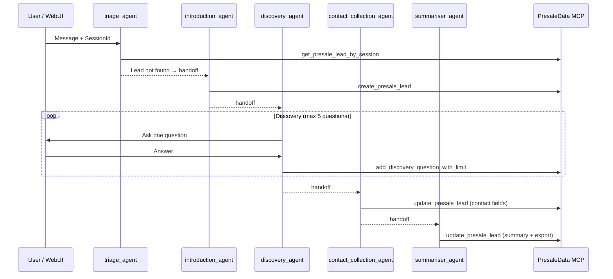

<!-- Generated by GitHub Copilot on 2026-03-31 -->
# Team Onboarding Guide

Welcome to the Interview Coach with Microsoft Agent Framework. This guide gets you from zero to productive as fast as possible.

---

## 1. What does this project do?

Interview Coach is a production-style AI application that helps users prepare for job interviews through guided, conversational coaching. Users chat with an AI agent that walks them through uploading a résumé and job description, asking behavioural questions (STAR format), drilling into technical topics, and generating a post-interview summary. The same codebase also ships a second workflow — the **Baoh Presale Assistant** — a multi-agent sales discovery bot that collects lead information, runs a structured Q&A, and exports a structured summary. The active workflow is controlled by a single config switch.

The project's deeper purpose is educational: it demonstrates the patterns you would need for a real agent deployment. Every architectural choice — MCP for tool extensibility, Aspire for multi-service orchestration, the handoff pattern for specialist routing — is documented and justified so you can transplant the same approach into your own product. It supports four LLM providers (Microsoft Foundry, Azure OpenAI, GitHub Models, GitHub Copilot) and deploys to Azure Container Apps with a single `azd up` command.

---

## 2. Architecture overview

```mermaid
graph TD
    subgraph Client
        UI[Blazor WebUI\nTailwind + Marked.js]
    end

    subgraph Agent["Agent Service (Microsoft Agent Framework)"]
        AF[AgentDelegateFactory\nSingle | LlmHandOff | BaohAssistant]
        HF[HandoffToolResultFix\nstreaming patch]
        WE[WorkflowExtensions]
    end

    subgraph MCP Servers
        MI[MarkItDown MCP\nPDF / DOCX → Markdown\nPython / Docker]
        ID[InterviewData MCP\nEF Core + SQLite]
        PD[PresaleData MCP\nEF Core + SQLite]
    end

    subgraph LLM
        FD[Microsoft Foundry]
        AO[Azure OpenAI]
        GM[GitHub Models]
        GC[GitHub Copilot]
    end

    subgraph Orchestration
        AH[.NET Aspire AppHost\nService discovery + health]
    end

    UI -- "AG-UI (SSE)" --> AF
    AF -- "HTTP/SSE" --> MI
    AF -- "HTTP/SSE" --> ID
    AF -- "HTTP/SSE" --> PD
    AF -- "IChatClient" --> FD
    AF -- "IChatClient" --> AO
    AF -- "IChatClient" --> GM
    AF -- "IChatClient" --> GC
    AH -. orchestrates .-> UI
    AH -. orchestrates .-> AF
    AH -. orchestrates .-> MI
    AH -. orchestrates .-> ID
    AH -. orchestrates .-> PD
```

### Agent modes

| Mode | Agents | Use case |
|------|--------|----------|
| `Single` | 1 `ChatClientAgent` | Simple interview scenarios |
| `LlmHandOff` | 5 specialists (Triage → Receptionist → Behavioural → Technical → Summariser) | Interview coaching with specialist routing |
| `BaohAssistant` | 6 specialists (Triage → Introduction → Discovery → ContactCollection → Summariser → Email) | Presale discovery and lead export |

The active mode is set by `AgentMode` in `apphost.settings.json` or via `--mode` CLI argument.

### Data flow (BaohAssistant, primary)



---

## 3. Key files to read first

| # | File | Why |
|---|------|-----|
| 1 | [src/InterviewCoach.Agent/AgentDelegateFactory.cs](../src/InterviewCoach.Agent/AgentDelegateFactory.cs) | Entry point for all agent logic. Creates agents, wires MCP tools, defines instructions for every mode. Start here. |
| 2 | [apphost.cs](../apphost.cs) | Aspire app model. Defines all services, dependencies, and config injection. Shows how the pieces connect. |
| 3 | [apphost.settings.json](../apphost.settings.json) | Primary runtime config. `AgentMode` and `LlmProvider` switches live here. |
| 4 | [src/InterviewCoach.Agent/Program.cs](../src/InterviewCoach.Agent/Program.cs) | ASP.NET Core startup for the agent service. MCP client wiring and DI registration. |
| 5 | [src/InterviewCoach.Agent/HandoffToolResultFix.cs](../src/InterviewCoach.Agent/HandoffToolResultFix.cs) | Streaming patch for handoff tool results. Touch this if handoff/streaming breaks. |
| 6 | [src/InterviewCoach.Agent/WorkflowExtensions.cs](../src/InterviewCoach.Agent/WorkflowExtensions.cs) | Extension methods for building handoff workflow graphs. |
| 7 | [src/InterviewCoach.Mcp.InterviewData/](../src/InterviewCoach.Mcp.InterviewData/) | Custom MCP server for interview session storage. Reference for how to build your own MCP server. |
| 8 | [src/InterviewCoach.Mcp.PresaleData/](../src/InterviewCoach.Mcp.PresaleData/) | Custom MCP server for the presale workflow. Includes atomic invariants (discovery cap, export dedup). |
| 9 | [src/InterviewCoach.WebUI/](../src/InterviewCoach.WebUI/) | Blazor frontend. AG-UI protocol integration, session ID generation, and chat rendering. |
| 10 | [docs/ARCHITECTURE.md](ARCHITECTURE.md) | Full written component-by-component breakdown with rationale. |

---

## 4. Development setup

### Prerequisites

- [.NET 10 SDK](https://dotnet.microsoft.com/download/dotnet/10.0)
- Visual Studio 2026 or VS Code + C# Dev Kit
- An LLM provider account (Microsoft Foundry is the default; see [provider options](providers/README.md))
- Docker Desktop (required for the MarkItDown MCP server container)

### First-time setup

```bash
# 1. Clone
git clone https://github.com/Azure-Samples/interview-coach-agent-framework.git
cd interview-coach-agent-framework

# 2. Store credentials (Microsoft Foundry — recommended default)
dotnet user-secrets --file ./apphost.cs set MicrosoftFoundry:Project:Endpoint "<your-endpoint>"
dotnet user-secrets --file ./apphost.cs set MicrosoftFoundry:Project:ApiKey   "<your-api-key>"

# 3. Build the solution
dotnet build InterviewCoach.slnx

# 4. Run full stack via Aspire
aspire run --file ./apphost.cs
```

After startup, the Aspire Dashboard URL appears in terminal output. Open it, confirm all resources show ✅ Running, then click the **webui** endpoint to start chatting.

### Alternative providers

```bash
# GitHub Models
aspire run --file ./apphost.cs -- --provider GitHubModels

# Azure OpenAI
aspire run --file ./apphost.cs -- --provider AzureOpenAI

# GitHub Copilot (forces CopilotHandOff mode)
aspire run --file ./apphost.cs -- --provider GitHubCopilot --mode CopilotHandOff
```

Set secrets for your chosen provider before running. See `docs/providers/` for per-provider setup guides.

### Deploy to Azure

```bash
azd up
```

This provisions Azure Container Apps, wires all services, and deploys. Requires the Azure CLI and an Azure subscription.

---

## 5. Common workflows

### How to add a new feature

1. **Understand the boundary.** Agent logic → `src/InterviewCoach.Agent`. Persistence/tools → an MCP server project. UI → `src/InterviewCoach.WebUI`. Do not add data access or storage directly to the Agent or WebUI.

2. **Add agent behavior** (new instructions, a new specialist agent, or a new handoff leg) in `AgentDelegateFactory.cs`. Follow the patterns already there for `ChatClientAgent` construction and tool scoping.

3. **Add a new MCP tool** if the feature needs new persistence or external data:
   - Add a `[McpServerTool]`-attributed method in the relevant MCP server project.
   - Register it in the MCP server's DI and endpoint mapping.
   - No Agent restarts required — the agent discovers tools at startup via `ListToolsAsync()`.

4. **Wire config switches** if the feature is mode- or provider-dependent. Add entries to `apphost.settings.json` and read them through `IConfiguration`.

5. **Build and validate:**
   ```bash
   dotnet build InterviewCoach.slnx
   dotnet test InterviewCoach.slnx
   aspire run --file ./apphost.cs
   ```

6. **Update docs** if you touched architecture behavior (`docs/ARCHITECTURE.md`, `docs/MULTI-AGENT.md`) or setup steps (`README.md`, `docs/TUTORIALS.md`).

### How to run tests

```bash
# All tests
dotnet test InterviewCoach.slnx

# Just agent tests (fastest feedback loop)
dotnet test tests/InterviewCoach.Agent.Tests/InterviewCoach.Agent.Tests.csproj

# Single test by name
dotnet test tests/InterviewCoach.Agent.Tests/InterviewCoach.Agent.Tests.csproj \
  --filter "FullyQualifiedName~HandoffToolResultFixTests"
```

The test suite covers handoff streaming (`HandoffToolResultFixTests`), workflow prompt contracts (`BaohAssistantWorkflowPromptContractTests`), payload building (`DiscoveryPayloadBuilderTests`), UI components (`LandingPageComponentTests`, `ChatInputComponentTests`), and EF Core serialization (`PresaleLeadRepositorySerializationTests`).

### How to debug issues

**Agent not responding / tool calls failing:**
1. Open the Aspire Dashboard → select the `agent` resource → view logs.
2. Look for MCP tool call entries: `Calling tool: <name>` and `Tool response: ...`.
3. If the MCP server is unreachable, check health status in the Aspire Dashboard for `mcp-interview-data` / `mcp-presale-data`.

**Handoff / streaming issues:**
- `HandoffToolResultFix.cs` patches a known SDK behaviour for streaming handoff results. Check tests in `HandoffToolResultFixTests.cs` first to understand the expected pass-through contract before changing anything here.

**Session state out of sync:**
- Aspire exposes a SQLite Web viewer. Use it to inspect session and presale lead records directly without a separate DB client.
- Navigate to the `sqlite-web` resource in the Aspire Dashboard.

**LLM provider errors:**
- Verify credentials are set via `dotnet user-secrets list --file ./apphost.cs`.
- Confirm `LlmProvider` and `AgentMode` in `apphost.settings.json` match the credentials you stored.
- See per-provider troubleshooting in `docs/providers/`.

**Build failures targeting wrong SDK:**
- Run `dotnet --version` and confirm it matches the version in `global.json`. The project requires .NET 10.

---

## 6. Gotchas and conventions

| Topic | What to know |
|-------|-------------|
| **Config is king** | `AgentMode` and `LlmProvider` in `apphost.settings.json` control everything. Never hard-code provider or mode selection in feature code. |
| **MCP boundaries are strict** | The Agent and WebUI must not access SQLite or any storage directly. All persistence goes through an MCP server. This is enforced by architecture, not the compiler — it is easy to break inadvertently. |
| **`HandoffToolResultFix` is load-bearing** | It patches streaming behaviour for handoff tool results. If you change handoff or streaming logic, run `HandoffToolResultFixTests` first and keep them green. |
| **Async all the way down** | No `.Result` or `.GetAwaiter().GetResult()` in feature code. All async APIs must be awaited. The one exception is tool list initialization at startup in `Program.cs` (a known boundary). |
| **Provider–mode coupling** | `GitHubCopilot` as a provider requires `CopilotHandOff` mode. Other providers work with any mode. |
| **No backward compatibility** | When you change a feature, remove the old code entirely. Do not leave legacy paths or fallback modes to satisfy old behavior. |
| **Nullable + implicit usings** | Both are enabled in all projects. Do not add redundant `using` statements and handle nullable references explicitly. |
| **Secrets never in source** | All credentials go in user secrets or environment variables. `apphost.settings.json` uses `{{PLACEHOLDER}}` tokens — never replace those with real values. |
| **Commit conventions** | Use Conventional Commits: `feat|fix|refactor|build|ci|chore|docs|style|perf|test`. |
| **File header** | Add a comment at the top of new files: `// Generated by GitHub Copilot on YYYY-MM-DD`. |
| **DB migrations** | EF Core migrations live in the MCP server projects. Run `dotnet ef migrations add <Name>` from inside the relevant project directory. |

---

## 7. Who to ask for help

The project is an open-source Azure Sample. For questions and issues:

- **GitHub Issues**: [github.com/Azure-Samples/interview-coach-agent-framework/issues](https://github.com/Azure-Samples/interview-coach-agent-framework/issues) — search before opening a new issue.
- **Pull Requests**: [github.com/Azure-Samples/interview-coach-agent-framework/pulls](https://github.com/Azure-Samples/interview-coach-agent-framework/pulls) — check for existing PRs before submitting one.
- **Code of Conduct questions**: [opencode@microsoft.com](mailto:opencode@microsoft.com)
- **CLA questions**: [cla.opensource.microsoft.com](https://cla.opensource.microsoft.com)

For internal teams using this as a base, the best starting points for context are:

- `docs/ARCHITECTURE.md` — rationale for every structural decision
- `docs/MULTI-AGENT.md` — deep dive on agent modes and handoff topology
- `docs/TUTORIALS.md` — hands-on walkthroughs for common changes
- `docs/FAQ.md` — answers to common "why not X?" questions
