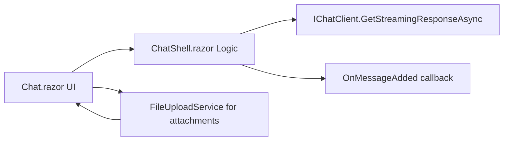

<!-- Generated by GitHub Copilot on 2026-03-22 -->

# Issue 5 Solution Proposal: Extract Reusable ChatShell Logic Component

## Scope and Objective

Build a reusable `ChatShell` logic component in WebUI that centralizes:

- Chat message state
- Streaming response orchestration
- Session/conversation ID handling
- Reset and cancel flows

Then wire the existing `/interview` page to use the new `ChatShell` API without behavior regressions.

## High-Level Approach

1. Introduce a headless Razor component (`ChatShell.razor`) that contains state + orchestration logic currently in `Chat.razor`.
2. Expose required public API for issue #5:
   - Message accessor
   - Current in-progress response accessor
   - `AddUserMessageAsync`
   - `ResetConversationAsync`
   - `CancelAnyCurrentResponse`
   - `ConversationId` parameter
   - `OnMessageAdded` callback parameter
3. Keep composition/UI responsibilities in `Chat.razor` (header, message list, input, file attachment UX).
4. Validate by building `InterviewCoach.slnx` and smoke-checking the `/interview` flow.

## Affected Repositories and Components

- Repository: this workspace repository (single-repo scope)
- Affected project: `src/InterviewCoach.WebUI`
- Primary components:
  - `Components/Pages/Chat/Chat.razor`
  - New `Components/Pages/Chat/ChatShell.razor`
- Supporting dependencies retained:
  - `IChatClient`
  - `ChatOptions`
  - `ChatMessage`
  - `ChatInput`
  - `FileUploadService`

## Proposed File Changes

### 1) Create ChatShell component

- New file: `src/InterviewCoach.WebUI/Components/Pages/Chat/ChatShell.razor`
- Responsibilities:
  - Own mutable chat state (`messages`, `currentResponseMessage`, session IDs)
  - Perform streaming call loop and incremental assistant message updates
  - Handle cancellation and reset semantics
  - Emit `OnMessageAdded` for user and finalized assistant messages

### 2) Refactor Chat page to consume ChatShell

- Update file: `src/InterviewCoach.WebUI/Components/Pages/Chat/Chat.razor`
- Responsibilities after refactor:
  - Keep page route and layout
  - Keep file-upload preprocessing (read attached file, upload, append URL to user text)
  - Delegate chat orchestration calls to `@ref` `ChatShell` instance
  - Bind UI to `ChatShell.Messages` and `ChatShell.CurrentResponseMessage`

## Proposed ChatShell API (Contract)

```csharp
[Parameter] public string? ConversationId { get; set; }
[Parameter] public EventCallback<ChatMessage> OnMessageAdded { get; set; }

public IReadOnlyList<ChatMessage> Messages => messages;
public ChatMessage? CurrentResponseMessage => currentResponseMessage;
public string CurrentConversationId => sessionId;

public Task AddUserMessageAsync(ChatMessage userMessage, CancellationToken cancellationToken = default);
public Task ResetConversationAsync();
public void CancelAnyCurrentResponse();
```

Notes:

- `CurrentConversationId` provides read access to the effective session, while `ConversationId` parameter supports external override/init.
- Keep `CancellationToken` optional in method signature for future reuse by mini-chat host.

## Implementation Task Breakdown

1. Extract shared state + methods into `ChatShell.razor`
   - Move `AddSessionSystemMessages`, `BuildOutboundMessages`, streaming loop, cancel/reset methods.
   - Preserve current logging/error handling behavior.
2. Add public accessors + required parameters
   - `Messages`, `CurrentResponseMessage`, `ConversationId`, `OnMessageAdded`.
3. Move file-upload logic boundary decision
   - Keep file upload in `Chat.razor` for Slice 1 to avoid changing existing `ChatInput` ownership and to avoid introducing broader API in this slice.
4. Rewire `Chat.razor`
   - Use `ChatShell` via `@ref`.
   - Route `ChatInput.OnSend` to page handler that performs optional file upload, then calls `ChatShell.AddUserMessageAsync`.
   - Keep existing focus behavior.
5. Build and verify
   - Run `dotnet build InterviewCoach.slnx`.
   - Manual smoke validation of `/interview` message-send, stream, cancel, reset behavior.

## Behavioral Compatibility Targets

- Preserve current session bootstrap semantics (`SystemPrompt`, session message with `SessionId`).
- Preserve cancellation behavior where in-progress assistant content is appended before cancel.
- Preserve JSON parse error handling and user-facing fallback message.
- Preserve message ordering and streaming UI updates.

## Architecture Sketch



## Risks and Complexities

1. Streaming race conditions
   - Risk: cancellation while stream is updating can duplicate or reorder message fragments.
   - Mitigation: keep cancellation and append semantics identical to current implementation.
2. ConversationId ownership ambiguity
   - Risk: conflict between externally supplied `ConversationId` and internally generated session IDs.
   - Mitigation: define precedence clearly: if parameter is supplied on init, use it; reset generates new session unless explicit override behavior is requested.
3. Callback semantics
   - Risk: noisy `OnMessageAdded` if fired on every token update.
   - Mitigation: emit callback on discrete message additions (user message add, finalized assistant message add), not on partial token updates.

## Knock-on Effects / Contradictions to Resolve

1. PRD US-2 includes `IncludeFileUpload` parameter, but issue #5 acceptance criteria does not.
   - Recommendation: defer `IncludeFileUpload` to the next slice to keep issue #5 scope tight.
2. Exposing both `ConversationId` and internal reset-generated IDs can produce unclear state transitions.
   - Recommendation: document parameter behavior in XML comments and enforce one deterministic precedence rule.

## Verification Plan

1. Build verification

```powershell
dotnet build InterviewCoach.slnx
```

2. Manual functional checks on `/interview`
   - Send a text-only message and confirm streamed assistant response appears incrementally.
   - Attach a supported file, send, and verify uploaded URL is included in outbound content.
   - Trigger New Chat and verify message list resets and a new session ID is created.
   - Send a message while another response is in-flight to validate cancel-and-continue behavior.
   - Confirm no exceptions in browser console and no service-level JSON parse regressions.

## Proposed Delivery Sequence

1. Implement `ChatShell.razor` with extracted logic and API.
2. Refactor `Chat.razor` to consume `ChatShell`.
3. Build and run smoke checks.
4. If stable, open follow-up issue for optional hardening tests around cancellation and streaming order.

## Optional Follow-Up (Recommended)

- Add focused component tests for cancellation/streaming ordering behavior to reduce regression risk before Slice 2 (`FloatingChatWidget`) consumes `ChatShell`.
