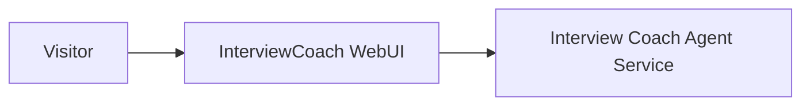
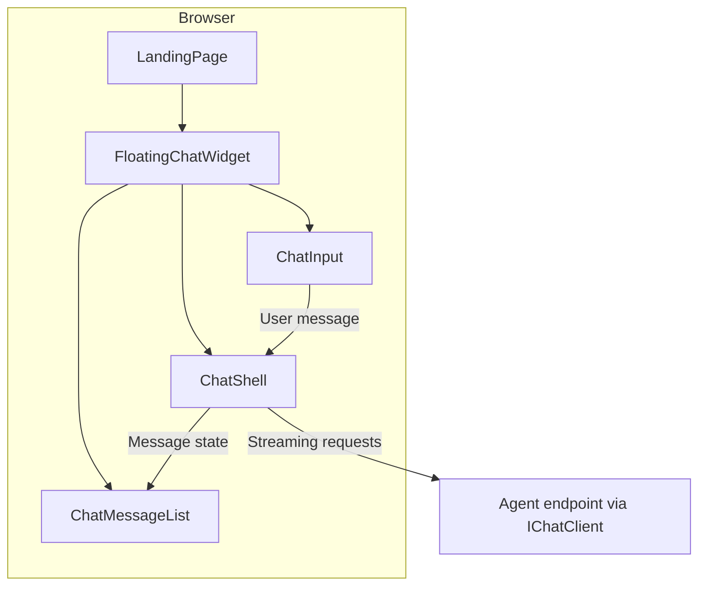

<!-- Generated by GitHub Copilot on 2026-03-22 -->

# Issue 6 Solution Proposal: Floating Mini-Chat Widget

## Scope and Objective

Deliver a floating mini-chat widget for the landing page with:

- Closed state as a floating launcher button
- Open state as a chat window with header/actions
- Auto-open on first page render
- Responsive behavior:
  - Desktop: fixed card at bottom-right
  - Mobile: bottom-sheet style panel
- Chat powered by existing ChatShell behavior
- File upload hidden/disabled in the mini-chat input

## Current-State Validation

- Chat orchestration logic is already centralized in ChatShell.
- Landing page currently renders a Technologies section that this slice can replace.
- ChatInput currently always renders the file-attachment control, so one targeted API extension is needed to satisfy "file upload disabled" behavior for mini-chat.

## High-Level Approach

1. Create a new UI component for floating chat behavior:
   - src/InterviewCoach.WebUI/Components/Pages/Chat/FloatingChatWidget.razor
   - src/InterviewCoach.WebUI/Components/Pages/Chat/FloatingChatWidget.razor.css
2. Compose existing chat building blocks inside the widget:
   - ChatShell for state + streaming
   - ChatMessageList for transcript rendering
   - ChatInput for message entry
3. Add one small extensibility point to ChatInput:
   - Add IncludeFileUpload parameter (default true)
   - Conditionally hide attachment button + InputFile when false
4. Integrate FloatingChatWidget into LandingPage and remove Technologies section from the page body and footer nav links.
5. Validate with desktop/mobile manual checks and solution build.

## Affected Repositories and Components

- Repository: this workspace repository (single-repo)
- Project: src/InterviewCoach.WebUI
- Primary files to add:
  - src/InterviewCoach.WebUI/Components/Pages/Chat/FloatingChatWidget.razor
  - src/InterviewCoach.WebUI/Components/Pages/Chat/FloatingChatWidget.razor.css
- Primary files to modify:
  - src/InterviewCoach.WebUI/Components/Pages/LandingPage.razor
  - src/InterviewCoach.WebUI/Components/Pages/LandingPage.razor.css
  - src/InterviewCoach.WebUI/Components/Pages/Chat/ChatInput.razor

## Proposed UI/Behavior Contract

### FloatingChatWidget state model

- isOpen: controls open/closed widget state
- hasAutoOpened: prevents repeated delayed auto-open in same component lifecycle
- chatShell reference: used to call AddUserMessageAsync and ResetConversationAsync if needed

### Header/actions

- Title text: Interview Coach
- Minimize action: hides panel, preserves in-memory conversation state
- Close action: behaves like minimize in this slice (hide only, preserve in-memory conversation state)

### First-open behavior

- In first-render lifecycle, wait 500 ms then open automatically once
- No persistence in localStorage for MVP (session-only behavior)

### Responsive behavior

- Desktop (>= 769px):
  - Width: 400px
  - Max-height: 600px
  - Position: fixed, bottom/right spacing from viewport edges
- Mobile (<= 768px):
  - Width: 100%
  - Max-height: 90vh
  - Position: fixed bottom sheet with rounded top corners
  - Entry animation: 300 ms slide-up

## Proposed File Changes

### 1) Add FloatingChatWidget component

New file: src/InterviewCoach.WebUI/Components/Pages/Chat/FloatingChatWidget.razor

Responsibilities:

- Render launcher button when closed
- Render panel shell when open
- Host ChatShell and bind child components:
  - ChatMessageList Messages <- ChatShell.Messages
  - ChatMessageList InProgressMessage <- ChatShell.CurrentResponseMessage
  - ChatInput OnSend -> handler calling ChatShell.AddUserMessageAsync
  - ChatInput IncludeFileUpload = false
- Execute auto-open delay behavior
- Implement minimize/close actions

### 2) Add FloatingChatWidget styling

New file: src/InterviewCoach.WebUI/Components/Pages/Chat/FloatingChatWidget.razor.css

Responsibilities:

- Fixed positioning and z-index layering above landing content
- Desktop dimensions and spacing
- Mobile bottom-sheet dimensions and animation
- Header, body, and input-area internal layout
- Accessibility affordances for focus states and reduced-motion users

### 3) Extend ChatInput for conditional file-upload UI

Update file: src/InterviewCoach.WebUI/Components/Pages/Chat/ChatInput.razor

Change summary:

- Add parameter:
  - [Parameter] public bool IncludeFileUpload { get; set; } = true;
- Wrap attach-button and hidden InputFile UI in conditional render block.
- Keep existing behavior unchanged when parameter is omitted.

Rationale:

- Enables mini-chat to disable upload without forking ChatInput.
- Preserves full-page interview experience by default.

### 4) Integrate widget into LandingPage and remove Technologies section

Update file: src/InterviewCoach.WebUI/Components/Pages/LandingPage.razor

Change summary:

- Remove Technologies section markup
- Remove Technologies footer anchor
- Remove technologies data-loading call and related model field
- Add FloatingChatWidget instance near end of page container

Scope decision: removing Technologies is intentionally part of issue 6.

Update file: src/InterviewCoach.WebUI/Components/Pages/LandingPage.razor.css

Change summary:

- Remove now-unused technologies section style blocks if they become orphaned
- Ensure bottom spacing does not conflict with floating launcher on narrow viewports

## Architecture Views

### C4 Level 1 (Context)



### C4 Level 2 (Container)



## Risks and Complexities

1. Contradiction: issue text says blocked by #5 while local issue snapshot still shows #5 as OPEN.
- Impact: process ambiguity for workflow gating.
- Mitigation: proceed based on code evidence (ChatShell exists and is usable now); refresh local issue mirror as an optional hygiene task.

2. Current ChatInput has no IncludeFileUpload parameter.
- Impact: mini-chat cannot disable attachment control without modification.
- Mitigation: add IncludeFileUpload with safe default true.

3. Widget + page reveal animations may compete on first paint.
- Impact: visual jank risk.
- Mitigation: keep widget animation isolated and respect prefers-reduced-motion.

4. Z-index conflicts with existing fixed elements.
- Impact: widget can hide under overlays.
- Mitigation: set explicit z-index above page chrome while below critical global alerts if required.

## Verification Plan

1. Build

```powershell
dotnet build InterviewCoach.slnx
```

2. Required targeted regression checks

- ChatInput regression check:
  - Confirm full chat page still shows attachment controls by default.
  - Confirm mini-chat passes `IncludeFileUpload=false` and attachment controls are hidden.
- Close/minimize behavior check:
  - Both close and minimize hide the panel and preserve transcript state for this slice.

3. Manual UI checks

- Desktop viewport:
  - Launcher appears bottom-right when closed
  - Auto-open occurs once after initial render delay
  - Minimize returns to launcher and preserves conversation
  - Close returns to launcher and preserves conversation
- Mobile viewport:
  - Panel opens as bottom sheet up to 90vh
  - Open animation duration and direction are correct
- Messaging:
  - User messages send successfully
  - Streaming responses render in progress
  - File attachment UI is absent in mini-chat input

4. Optional broader test run

```powershell
dotnet test InterviewCoach.slnx
```

5. Regression spot-check

- Full chat page still shows attachment controls (default behavior)
- Landing page still renders hero/services/process/contact correctly after technologies removal

## Delivery Sequence

1. Implement ChatInput extensibility point.
2. Add FloatingChatWidget component and CSS.
3. Integrate widget into LandingPage and remove technologies references.
4. Run build and perform desktop/mobile checks.
5. Capture outcomes and proceed to create-todo step.

## Confirmed Scope Decisions (2026-03-22)

1. Removing Technologies is in-scope for issue 6.
2. Close behaves like minimize for this slice.
3. Execution proceeds based on code evidence for dependency #5.

## Beneficial Follow-Up Suggestions

- Add a focused bUnit/component test for ChatInput IncludeFileUpload rendering behavior.
- Add a UI-level test scenario for widget open/minimize/close transitions.
- Consider storing a session-level "dismissed once" flag if product later wants reduced auto-open frequency.
